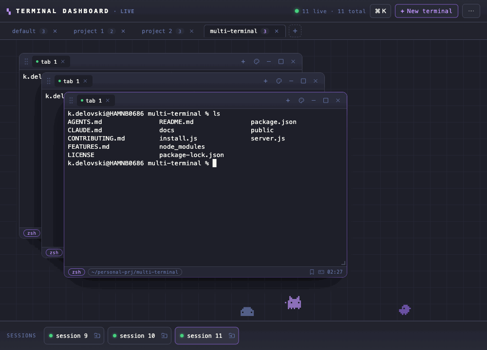

# Terminal Dashboard


**Juggling a dozen terminal tabs across projects?** This is one screen where every shell is a window you can see, move, tile, and group — and refreshing the browser never kills your session.

**[▶ See it in action](https://kiril6.github.io/termdeck/)** — showcase page with a live demo GIF.

A browser cockpit of floating, draggable terminal windows — each backed by a **real shell (PTY)** on your machine. Open many terminals, tile them, group them into projects, theme them, and reconnect without losing a session. No Electron, no build step: it's an Express server, a WebSocket PTY bridge, and one HTML file.

> Runs entirely on `localhost`. Your shells never leave your machine.



<sub>Floating shells → tile into a grid → theme picker → real filesystem tree → command palette (`⌘K`) → play a game while a command runs.</sub>

**Why not just tmux or iTerm?** You get tmux's session persistence *plus* a point-and-click GUI you don't have to learn — floating windows, projects, and themes in the browser you already have open, on macOS, Windows, and Linux alike.

---

## Features

**Windows & layout**
- **Floating windows** — drag, resize, minimize, maximize, tile into a grid.
- **Tabs per window** — multiple shells in one pane, scrollable tab strip.
- **Projects** — group windows into project tabs; switch context instantly. The 📁 Dir popover can **Spawn here** or open a path as a **New project** (tab named after the folder, tree rooted there).
- **Directory tree** (`⌘B`) — a real filesystem sidebar rooted at the active project, dirs lazy-expanding on click. **＋** on a folder opens a shell there; **⤢** on a file reveals it in Finder/Explorer.
- **Dock** — bottom session bar with activity/attention indicators; overflow scrolls with edge hints.

**Sessions & persistence**
- **Session reattach** — refresh the browser or drop your connection and the shell keeps running. A 60s grace timer holds the PTY; reconnecting replays the last 200 KB of output. Waking from sleep reconnects instantly instead of waiting on backoff.
- **Durable sessions (tmux)** — with `tmux` installed, shells run *inside* tmux, so they **survive a server restart or crash** (not just a browser refresh): restart `npm start` and reconnecting reattaches the still-living session. Auto-off where tmux is missing (incl. Windows). *(Nothing survives a full reboot — process memory is gone.)*
- **Run command on start / SSH** — spawn a shell that immediately runs a command (Dir popover → *Run command on start*, e.g. `npm run dev`). Save `ssh` targets (palette → *Add SSH host…*) and reconnect to a host in one click.
- **Live working directory** — each window's cwd badge follows the shell as it `cd`s. The backend polls each shell's real working dir from the OS (~1.5s), so it needs no shell config or `OSC 7`.
- **Persistent layout** — windows, projects, and themes saved to `localStorage`; a single-instance guard keeps two dashboard tabs from clobbering each other's state.

**Productivity**
- **Command palette** — `⌘K` for fuzzy actions, sessions, and snippets.
- **Command snippets** — save reusable commands and run them from the palette; a snippet is *typed* into the focused shell (not auto-run) so you can review before pressing Enter.
- **Broadcast input** — 📢 Cast (`⌘⇧B`) mirrors your keystrokes to **every live shell in the active project** at once (not other projects); a pulsing red state makes it obvious when it's on, and it auto-disarms when you switch projects.
- **Find in terminal** — `⌘F` inside a shell searches its scrollback with match highlighting and a result counter.
- **Safe paste** — paste goes through bracketed-paste (newlines don't auto-run at a shell prompt); multi-line pastes ask first.
- **Configurable scrollback** — palette → *Set scrollback…* sets the lines of history each terminal keeps (default 8000).
- **Save output** — right-click a terminal → *Save output…* to download its scrollback as a `.log`.
- **Read-only log panels** — mirror a shell's output with input disabled (`⌘L`).
- **Keyboard-first** — see the full shortcut list below or press `?` in the app.

**Look & feel**
- **Themes** — per-terminal or dashboard-wide, with a searchable picker (Dracula, Nord, Gruvbox, Tokyo Night, Catppuccin, and more).
- **Font zoom** — `⌘+` / `⌘-` / `⌘0` resize a single terminal's font (the PTY re-fits to match).
- **Clickable links** — URLs in output are detected and open in a new tab.
- **GPU rendering** — WebGL terminal renderer for smooth scrollback, with automatic fallback.
- **Ambient pixel pets** — low-key pixel critters wander the desktop's bottom edge while you're idle or away, and vanish the moment you're back (`⌘⌥P` to toggle; off under reduced-motion).

**While you wait**
- **Play a game** — palette → *Play game* or `⌘⌥G` opens 🦖 Dino or 🐍 Snake; it watches a chosen shell and pops a banner when the command finishes.
- **Long-run nudge** — a command running past 20s offers a game to pass the time, then reports how long the run took when it's done.

**Notifications**
- **Command-done alerts** — when a shell you're not watching finishes (prompt returns, bell, or OSC 133 shell-integration mark), a toast/desktop notification fires.
- **OS notifications** — in-app toasts mirror to native desktop notifications **only when the browser window is unfocused** (opt-in via the browser permission prompt).
- **Search & filter** sessions, with a visible "filter is on" indicator.

> **Limits:** up to 12 terminals per project and 10 project tabs, to keep a single browser tab responsive.

Cross-platform: **macOS, Windows, Linux** — uses prebuilt `node-pty` binaries, so no C++ compiler is required.

---

## Quick start

Requires **Node.js 18+**.

```bash
node install.js   # first-time setup — picks the right node-pty prebuilt for your OS
npm start         # runs the server → http://localhost:3000
```

**Optional but recommended:** install **tmux** so shells survive a server restart/crash
(macOS `brew install tmux`, Debian/Ubuntu `sudo apt install tmux`). Without it the app still
runs — shells just don't outlive the server. Not available on Windows; set `NO_TMUX=1` to force it off.

It **opens in your browser automatically**. If it didn't (or you're on a headless box), go to **http://localhost:3000**. To disable auto-open, set `NO_OPEN=1`. To pick a browser, set `BROWSER` — e.g. `BROWSER="Google Chrome" npm start` (macOS) or `BROWSER=firefox npm start` (Linux).

Override the port:

```bash
PORT=4000 npm start
```

### Hosting (and why not GitHub Pages)

This is a **local-first tool**, not a static site. Its core is a Node process (`server.js`) that opens a WebSocket and spawns real PTYs on the host — so:

- **GitHub Pages / Netlify / any static host won't work.** They serve files, not a Node server. Opened static, the app falls back to *demo* mode (UI only, **zero shells**). *(The [showcase page](https://kiril6.github.io/termdeck/) on GitHub Pages is just a landing page — the real app runs locally.)*
- To run it anywhere but your own machine you need a host that runs **Node + a persistent process + WebSockets** (a VPS, Fly.io, Render, Railway…). Before you do, read **[Security](#security)** — exposing it puts an unauthenticated shell on the network.

The intended deployment is: clone, `npm start`, use it on `localhost`.

### Windows notes

- Needs **Windows 10 1809+** (node-pty uses ConPTY).
- Defaults to `powershell.exe`. Make sure it's on your `PATH` (it is by default).

### Linux notes

- Installs the `@homebridge/node-pty-prebuilt-multiarch` prebuilt automatically — no compiler needed. If a prebuilt isn't available for your distro/arch, `node install.js` falls back to compiling, which needs `build-essential python3` (`sudo apt install build-essential python3`).
- The **⤢** "reveal in file manager" action uses `xdg-open` — install `xdg-utils` if it's missing (headless/minimal setups).

### Shells won't start?

Open **http://localhost:3000/debug** — it dumps your environment and tries each shell candidate, telling you exactly what failed.

---

## Keyboard shortcuts

On Windows/Linux, `⌘` = `Ctrl` and `⌥` = `Alt`.

> **Why some shortcuts use `⌥` (Alt).** The browser/OS reserves the plain combos (`⌘T` opens a
> browser tab, `⌘W` closes it, `⌘L` jumps to the address bar, `⌘⇧B`/`⌘⇧T`/`⌘⇧N` are bookmarks/
> reopen-tab/incognito) — a web page can't override those. Actions that would collide use `⌘⌥…`
> (mac) / `Ctrl+Alt+…` (Windows) instead, which the browser leaves for the page.

### Global
| Action | Shortcut |
|---|---|
| Command palette | `⌘K` |
| New terminal | `⌘⌥T` |
| New log panel | `⌘⌥L` |
| New project | `⌘⇧M` |
| Next / previous project | `⌘⇧]` / `⌘⇧[` |
| Search sessions | `⌘F` |
| Toggle directory tree | `⌘B` |
| Tile all windows | `⌘⌥⇧T` |
| Broadcast input to all shells | `⌘⌥B` |
| Open directory | `⌘⇧O` |
| Theme picker | `⌘⇧P` |
| Close focused window | `⌘⌥W` |
| Minimize focused | `⌘⌥M` |
| Toggle fullscreen | `F11` |
| This help screen | `?` |

### Tabs (in the focused window)
| Action | Shortcut |
|---|---|
| New tab | `⌘⌥N` |
| Next tab | `⌘]` |
| Previous tab | `⌘[` |

### In a terminal
| Action | Shortcut |
|---|---|
| Find in terminal | `⌘F` |
| Font size up / down | `⌘+` / `⌘-` |
| Reset font size | `⌘0` |

> `⌘F` finds within the focused terminal; with no terminal focused it filters sessions.

---

## Architecture

Three files. Backend + frontend, no framework beyond Express.

| File | Role |
|---|---|
| **`server.js`** | Express static server + `ws` WebSocket PTY multiplexer. One WebSocket per terminal, keyed by a client-supplied `id`. On disconnect the PTY is **not** killed — a 60s timer holds it so reconnecting replays the buffer. Shell chosen from `$SHELL` → PowerShell (Windows) → zsh/bash/sh. |
| **`public/index.html`** | The entire frontend in one file (HTML + CSS + JS, no bundler). xterm.js + addons served locally from `node_modules` at `/vendor` (no CDN — works offline). Floating panes, tiling, projects, themes, command palette, search. State persisted to `localStorage`. |
| **`install.js`** | One-shot dependency installer. Picks the `node-pty` variant for your platform and installs prebuilt binaries. |

**Core invariant:** *disconnect ≠ kill, reconnect replays buffer.* Any change to the WebSocket lifecycle in `bindWsEvents` / `connection` must preserve it.

### Security

This server spawns **real shells**, so access is locked down by default:

- **Loopback only** — binds `127.0.0.1`, so nothing on your network can reach it. To expose it deliberately (e.g. a trusted LAN), set `HOST=0.0.0.0` (or a specific IP); the server prints a warning when it does.
- **Origin + Host validation** — the WebSocket upgrade is rejected unless both headers resolve to a known localhost name. This blocks a malicious web page from opening a socket to your shells (cross-site / DNS-rebind), the main browser attack for a localhost service.

There is intentionally **no login/token**: a non-browser process already running as your user can spawn its own shell anyway, so a token would only be theater. If you ever expose this multi-user or over a tunnel, add real authentication in front of it.

### Demo vs. live mode

Served over `http://`/`https://` the app is **live** (real shells). Opened directly from the filesystem (`file://`) it falls back to **demo** mode with no backend — handy for previewing the UI.

---

## Contributing

Contributions welcome — see [`CONTRIBUTING.md`](CONTRIBUTING.md) for the ground rules (dependency-light backend, no build step, the reattach invariant) and the dev loop. Found a bug? [Open an issue](https://github.com/kiril6/termdeck/issues/new) with your **OS**, **Node version**, and the `/debug` page output if shells fail to start.

---

## License

MIT — see [`LICENSE`](LICENSE).

---

If Terminal Dashboard is useful to you, consider giving it a ⭐ — it helps others find it.
